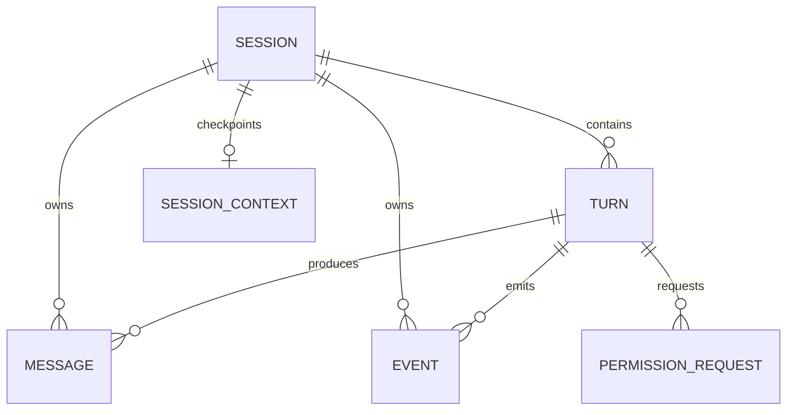
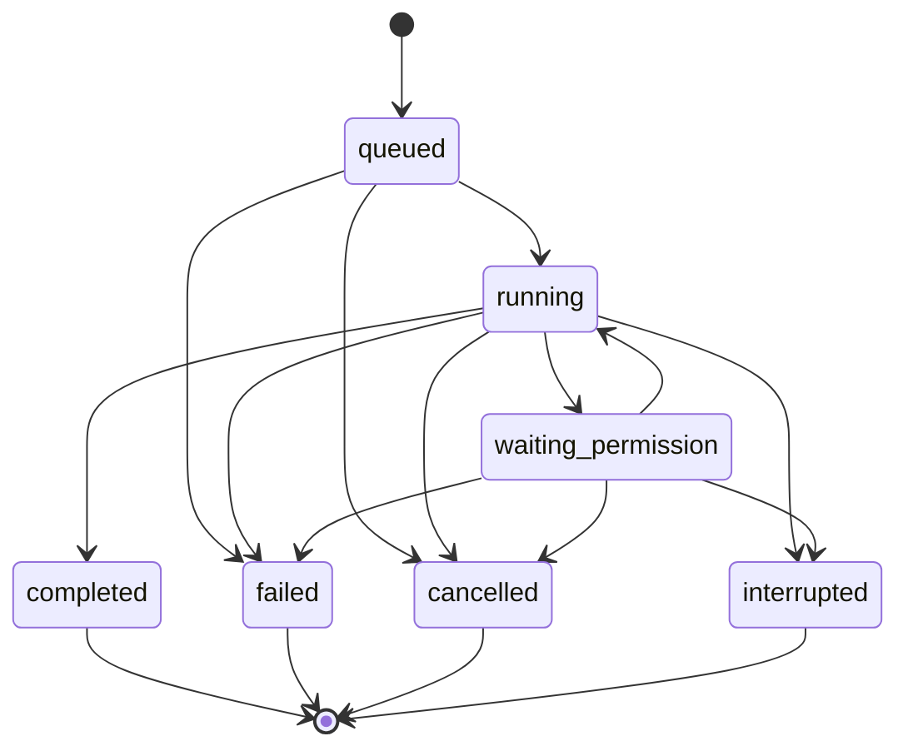

# 会话系统完整设计参考：Session、Turn、Message 与 Event

文档状态：后续扩展参考，不是当前实施清单。本文不表示项目已经实现这些能力。

**当前从主流程开始，请先看 [渐进实施路线](session-roadmap.md)。第一步包含 Session、最小 Turn、Message 和保存压缩上下文的 SessionContext，先实现一个会话内的连续聊天、消息保存与轮次查询；取消、恢复、去重及并发边界后续再加。**

下面保留较完整方案，供实际出现需求后选择性使用。最小 Turn 和独立 Context 从当前阶段引入；完整状态机、上下文增量重建与权限表后续按需增加；已有 Events 用于页面兼容，基础阶段沿用。

适用范围：当前 Python + SQLite 编程 Agent，单服务进程、本机使用。先实现可靠的会话与任务管理，再考虑多用户、多服务进程和自动恢复。

## 1. 要解决的问题

会话系统需要回答四个问题：我们在哪个会话里、这次任务进行到哪、具体产生了什么内容、页面应该展示什么变化。

| 对象 | 负责什么 | 例子 |
| --- | --- | --- |
| Session | 长期存在的聊天空间与工作区信息 | “学习这个项目” |
| Turn | 一次用户请求的完整执行及其状态 | “帮我修复登录问题” |
| Message | 用户输入、模型响应、工具结果等原始内容 | 一次 read_file 的返回值 |
| Event | 可持久化、按顺序重放的过程变化 | 工具开始执行、任务完成 |

Turn 是带状态机的执行记录。一次 Turn 可以包含多次模型 API 调用和多次工具调用；它不等于一次模型请求。



一次任务的例子：

```text
Session s1：项目分析
  Turn t1，turn_no=1：看看这个项目
    Message m1：用户输入
    Message m2：模型要求调用 read_file，tool_call_id=c1
    Message m3：c1 的结果
    Message m4：模型最终回复

    Events：任务排队、任务开始、消息创建、工具开始、
            工具完成、最终消息创建、任务完成

  Turn t2，turn_no=2：给我解释一下入口代码
    ……
```

## 2. 第一版的约定

1. 一个 Session 同时最多有一个活动 Turn，包括 queued、running、waiting_permission。忙时新请求返回 409，不在同一会话内排多个任务。
2. HTTP 请求负责接收任务，后台 Runner 负责执行。关闭页面不会取消任务。
3. 原始 Messages 追加保存；上下文压缩结果另存，不覆盖原始记录。
4. 成功接收请求意味着用户 Message 和 Turn 已提交到数据库。
5. 重要状态变更与对应 Event 在同一事务提交，然后才能对页面公布。
6. 服务重启后，执行中的 Turn 标记 interrupted；第一版不自动重跑可能已经产生副作用的工具。
7. 第一版只删除整个空闲会话，不提供删除单个 Turn 或编辑历史消息。历史修改和分支会话以后另行设计。
8. 同一工作区最多执行一个 Turn，先保守地按工作区串行。不同工作区可以并发。特别是 bash，不能靠命令名称可靠判断是否会写文件。

会话锁解决会话状态竞争，工作区执行锁解决同一份文件的竞争，两者不是同一件事。工具还必须绑定本次会话的工作区，不能继续全部依赖全局 WORKDIR。

## 3. 四种顺序和时间

| 字段 | 作用 | 规则 |
| --- | --- | --- |
| turn.id | 一次任务的稳定身份 | UUID，不承担排序职责 |
| turn.turn_no | 会话里的第几轮 | 从 1 开始，同一 Session 内唯一 |
| message.seq | 原始消息顺序与分页游标 | 数据库生成，全局递增，允许空缺 |
| event.seq | 事件顺序与增量游标 | 数据库生成，全局递增，允许空缺 |
| created_at | 对象创建时间 | UTC Unix 毫秒 |
| updated_at | 对象字段最后修改时间 | 不能作为任务顺序或进程存活依据 |
| started_at | 实际开始执行时间 | queued 时为空 |
| finished_at | 进入终态的时间 | 所有终态必须填写 |

会话内按 turn_no 排序，不按 updated_at 排序。更新旧 Turn 不应该改变它在聊天中的位置。

Turn 状态、取消请求、错误信息等字段变化时更新 updated_at；每条工具 Event 不必更新 Turn。以后需要心跳时单独增加 heartbeat_at，不能用 updated_at 猜测进程是否存活。

Session 的 updated_at 在提交请求、开始执行、进入终态、修改标题等业务活动发生时更新，不在每次页面轮询时更新。

Messages 和 Events 是追加记录，正常写入后不修改，因此只需要 created_at。

### 3.1 turn_no 如何分配

第一版在一个 BEGIN IMMEDIATE 事务内，查询该会话的 MAX(turn_no)，加一并插入。相同 request_id 的重试要先命中旧记录，不分配新序号。

```sql
SELECT COALESCE(MAX(turn_no), 0) + 1
FROM turns WHERE session_id = ?;
```

数据库用 UNIQUE(session_id, turn_no) 兜底。不能在事务外先查号再插入。

本方案禁止单独删除 Turn，因此不会因删除末轮而复用轮号。以后支持单轮删除时，改为 Session 持有 next_turn_no 计数器，并在同一事务递增。已有轮号不重新编号，允许空缺。

## 4. 数据模型

### 4.1 sessions

| 字段 | 含义 |
| --- | --- |
| id | 会话 ID |
| title | 标题 |
| workspace_path | 创建时确定的工作区绝对路径 |
| created_at / updated_at | 创建与最近活动时间 |
| archived_at | 归档时间，可空 |

运行状态从活动 Turn 查询，不另存 running 布尔值。归档的会话不能提交任务，恢复归档后才能继续。

workspace_path 使用统一的规范化策略，工作区锁也使用相同的键。第一版不在有历史记录的会话里切换工作区，新工作区创建新会话。

### 4.2 turns

| 字段 | 含义 |
| --- | --- |
| id / session_id / turn_no | 身份、归属与轮次 |
| request_id | 客户端为一次提交生成的去重 ID |
| request_hash | 规范化后的请求内容哈希，识别同 ID 不同内容 |
| status | 状态机当前状态 |
| model | 本轮实际使用的模型 |
| created_at / updated_at | 创建和最后修改时间 |
| started_at / finished_at | 执行起止时间 |
| cancel_requested_at | 用户请求停止的时间，可空 |
| error_code / error_message | 程序可判断的错误码和可读原因 |

用户请求正文由关联的 user_input Message 保存，不必重复放到 Turn。

request_hash 对规范化后的请求对象计算，例如 text、用户选择的模型、附件引用等实际可提交字段。序列化规则固定，重复请求必须用相同规则比较。以后修改服务端默认模型，不应改变已经提交的请求身份。

### 4.3 messages

| 字段 | 含义 |
| --- | --- |
| seq / id | 排序游标与稳定消息 ID |
| session_id / turn_id | 所属会话、所属任务 |
| kind | user_input、assistant_response、tool_result、control |
| role | 模型协议角色：user 或 assistant |
| content_json | 模型内容块的 JSON 数组 |
| tool_call_id | tool_result 对应的调用 ID，其他类型为空 |
| created_at | 创建时间 |

kind 是业务语义，role 是模型协议语义。当前 Anthropic 协议中，工具结果使用 user 角色，所以不能只靠 role 判断是不是用户输入。

一条 assistant_response 保留完整内容块及 SDK 要求的协议元数据。模型一次要求调用三个工具，三个 tool_use 可以都在同一条 assistant Message 中；每个工具结果各存一条 tool_result Message。

调用 ID 只要求在同一个 Turn 内唯一，查找和去重使用 (turn_id, tool_call_id)，不能只用工具名称。

写入时机：用户提交时存输入；完整模型响应返回时存响应；每个工具返回时立即存结果。工具失败也要存结果及 is_error，不能只记终端日志。

工具错误不一定结束 Turn；模型可以依据错误继续修复。最终模型响应只存一次，不要在 Runner 收尾时再复制一条。

大型输出先写入受管理的产物目录，成功后才记录引用。每次执行使用唯一产物名，前端只读取预览；会话删除时单独清理产物。不得让引用指向尚未成功保存的文件。

### 4.4 events

| 字段 | 含义 |
| --- | --- |
| seq | 持久化游标 |
| session_id / turn_id | 会话与任务归属；会话级事件的 turn_id 可空 |
| type | 事件类型 |
| payload_json | 展示与定位所需的数据 |
| created_at | 发生时间 |

最小事件类型：

```text
turn.queued / turn.started / turn.completed / turn.failed
turn.interrupted / turn.cancel_requested / turn.cancelled
message.created
tool.started / tool.completed
permission.requested / permission.resolved
context.compacted
```

事件示例：

```json
{
  "seq": 103,
  "session_id": "s1",
  "turn_id": "t1",
  "type": "tool.completed",
  "payload": {
    "tool_call_id": "c1",
    "message_id": "m3",
    "name": "read_file",
    "is_error": false,
    "preview": "README 内容预览"
  }
}
```

Message 是原始内容的来源，Event 是过程通知和重放记录。Event 可以带稳定的展示预览，但不要把整个模型协议数据重复塞进事件，也不要用截断预览构建模型上下文。

message.created 可以携带 message_id、kind 和展示预览，完整内容通过消息接口读取。模型协议元数据不直接作为页面输出。

### 4.5 两张辅助表

session_contexts 保存当前模型工作上下文：session_id、version、messages_json、through_message_seq、updated_at。

permission_requests 保存授权请求：id、session_id、turn_id、tool_call_id、question、status、created_at、expires_at、resolved_at。

这两张表分别服务于已有的上下文压缩和权限确认功能。它们不改变四个核心对象的含义。

## 5. Turn 状态机



| 状态 | 意义 |
| --- | --- |
| queued | 请求已保存，等待执行资源 |
| running | 正在准备上下文、请求模型或调用工具 |
| waiting_permission | 有一个尚未解决的授权请求 |
| completed | 本次执行正常结束，不代表修改在业务上绝对正确 |
| failed | 请求模型失败、轮数耗尽、内部错误等导致停止 |
| cancelled | 已确认停止后续执行 |
| interrupted | 进程退出等导致执行结果不完整 |

状态转换集中在服务层函数中，使用数据库条件更新，而不是在各处直接赋值。

```sql
UPDATE turns
SET status = 'running', started_at = ?, updated_at = ?
WHERE id = ? AND status = 'queued' AND cancel_requested_at IS NULL;
```

检查受影响行数；为 0 表示该转换已经失效，调用方重新读状态，不能继续启动任务。状态修改和事件提交必须处于同一事务。

终态不重新进入 running。用户明确重试或继续时创建新的 Turn、新 request_id、新 turn_no，旧记录保留。继续中断任务时必须处理未知工具结果，不能把普通重试等同于安全恢复。

取消先设置 cancel_requested_at，它是请求标志，不立即进入 cancelled。最终完成提交与取消提交使用事务竞争：若完成先提交，则取消返回已有终态；若取消先提交，Worker 在收尾时尊重取消标志。只有确认没有后续工具执行，才能释放执行资源并写 cancelled。

## 6. 请求、执行与事务边界

### 6.1 接收一次请求

```http
POST /sessions/s1/turns
Content-Type: application/json

{"request_id":"客户端 UUID","text":"看看这个项目"}
```

客户端在网络重试时复用 request_id，用户真正发新任务时生成新 ID。重试前保留原请求正文，不悄悄改成输入框中的新内容。

服务端流程，以下是伪代码：

```python
with store.immediate_transaction():
    session = require_existing_session(session_id)
    existing = find_turn(session_id, request_id)
    if existing:
        require_same_request_hash(existing, request_hash)
        return existing

    require_not_archived(session)
    require_no_active_turn(session_id)
    turn_no = next_turn_no(session_id)
    turn = insert_turn(status="queued", turn_no=turn_no)
    message = insert_user_message(turn.id, text)
    append_event("turn.queued", turn_id=turn.id)
    append_event("message.created", message_id=message.id)
    touch_session(session_id)
# 必须在事务成功提交后，才能向客户端返回成功。
```

新任务返回 202 和 turn_id；去重命中返回已有 Turn 的当前状态。相同 ID 不同内容返回 409，另一个 Turn 正在活动也返回 409。

忙时拒绝的请求不创建用户 Message，不消耗 turn_no。数据库写入失败不能返回“已接收”。

### 6.2 后台调度

一个调度线程定期扫描 queued Turn，只有有执行线程和工作区资源时才领取任务。在同一短事务里将 queued 改为 running 并追加 turn.started。通知只用于减少延迟，数据库里的 queued 才是任务来源，避免“接收成功但内存通知丢了”。

不同工作区通过有限数量的 Worker 并发。暂时拿不到工作区锁时保持 queued，不占用线程长时间等待。SQLite 锁只覆盖事务，不能包住模型请求、工具执行或授权等待。

单 SQLite 连接仍可沿用当前的连接锁，但锁必须覆盖整段事务，不能逐条 SQL 解锁，避免别的线程进入同一事务。

### 6.3 执行一个 Turn

1. 读取该会话 Context 与尚未处理的 Messages，检查协议完整性。
2. 在模型调用前检查取消请求，必要时压缩并保存检查点。
3. 请求模型，完整响应返回后持久化 assistant Message。
4. 如果需要工具，逐个检查取消、校验参数、申请必要授权。
5. 获得授权并准备执行后，先提交 tool.started，再实际调用工具。
6. 工具返回后，把结果 Message 与 tool.completed 一起提交。
7. 当前批次结果齐全后构建新的 Context，然后请求下一次模型响应。
8. 无工具调用且 Stop hook 不要求继续时，把最终 Message、终态与完成 Event 一起提交。

tool.started 表示执行已获准并准备进入工具，进程可能恰好在写完此事件后崩溃。因此“有开始记录但没结果”只能说明结果未知，不能推断工具一定执行过或一定没执行过。

### 6.4 原子操作清单

| 动作 | 同一事务内必须写入 |
| --- | --- |
| 接收请求 | queued Turn、用户 Message、对应 Events、会话活动时间 |
| 领取任务 | running 状态、起始时间、turn.started |
| 中间模型响应 | assistant Message、message.created |
| 工具完成 | tool_result Message、message.created、tool.completed |
| 正常结束 | 最终 Message、message.created、completed 状态、turn.completed |
| 请求停止 | cancel_requested_at、updated_at、turn.cancel_requested |
| 创建授权 | permission 记录、waiting_permission、permission.requested |
| 解决授权 | permission 结果、后续状态、permission.resolved |
| 保存压缩结果 | Context 版本与游标、context.compacted |

网络发送放在提交之后。页面断线可以忽略；重要持久化失败不能吞掉后继续执行。数据库故障时停止调度和后续工具调用，向可用的 HTTP 响应及本地日志报告原因；不能指望损坏的数据库还能可靠保存“数据库错误”事件。

## 7. Message 和 Context 如何配合

原始 Messages 记录事实，Context 是给模型使用的可替换工作副本。

```text
原始 Messages → 协议组装 → 压缩 → Context 检查点 → 模型请求
```

through_message_seq 表示检查点已处理到的位置，不表示摘要仍逐字包含所有旧消息。

一次模型响应可能要求三个工具。结果逐个保存，但 Context 只能在三个调用都有对应结果后推进到该批次末尾，不能跳过未完成调用后继续处理新用户输入。组装器负责把逐条存储的 tool_result 合并为协议要求的消息形状。

压缩在工作副本上操作，保存新的 messages_json 和 version，不修改原始 Messages。保留当前用户请求原文，摘要作为参考资料；原文、摘要和工具结果的可信级别沿用系统提示词中的约定。

中断后新增 Turn 前，先执行恢复整理：保留原始未闭合记录，在模型工作上下文中把未确认结果明确表示为“执行中断，结果未知”，必要时补充协议合法的错误结果或改写成事实性恢复说明。不能补“成功”，不能直接重跑。对修改文件等任务，要求先检查实际文件状态。

Context 不是完整执行检查点。Todo 等工具内存状态如果需要跨重启保留，必须独立保存，或从有明确结构的记录重建；不能因为保存了模型消息就声称整个 Agent 可自动恢复。

## 8. 前端加载与事件同步

第一版采用快照 + 增量轮询：

- 初次打开读取最近一页 Messages、关联 Turn、活动工具/授权状态、snapshot_cursor。
- 以上快照信息和游标在同一数据库读事务中取得。
- 然后拉取 seq > snapshot_cursor 的事件，按升序消费。
- 更早消息使用 message.seq 向前分页；需要查看某轮详细过程时读取其 Events。

活动工具状态可由当前 Turn 的 tool.started 与 tool.completed 配对得到，不能只读最终 Message。客户端使用 message_id、tool_call_id 更新已有视图，避免快照与事件重复创建内容。

```http
GET /sessions/s1/events?after=103&limit=200
```

```json
{"events": [], "next_cursor": 103, "has_more": false}
```

按 seq 处理并去重。同一响应中如还有未取完数据，next_cursor 只能推进到已返回的最后一条，不能直接跳到数据库最新事件。无事件时保留输入游标。游标不连续是正常的。

前端切换会话要同时校验会话 ID 和视图版本；只检查 ID 不够，因为用户可能 A → B → A，第一次 A 的旧响应仍会过时。

```javascript
let viewVersion = 0;

async function switchTo(sessionId) {
  const version = ++viewVersion;
  current = sessionId;
  clearView();
  const snapshot = await loadSnapshot(sessionId);
  if (version !== viewVersion || current !== sessionId) return;
  renderSnapshot(snapshot);
  startPolling(sessionId, version, snapshot.snapshot_cursor);
}
```

轮询应用相同的版本检查，每个视图最多一个拉取请求在途。消费完成后再推进游标，渲染失败不能跳过事件。页面刷新时重新获取快照，不能仅凭本地保存的游标跳过尚未恢复的页面内容。

今后改为 SSE 或 NDJSON 长连接，仍复用同一套持久化游标和去重规则。第一版不需要同时实现多种推送协议。

## 9. 取消、授权与重启

### 9.1 取消

取消接口对重复点击返回相同或更新后的状态。queued 可以原子地改为 cancelled；running 和 waiting_permission 先记录取消请求，唤醒等待中的执行线程。

Worker 在模型调用前后、工具开始前、授权等待中及最终收尾时检查。工具执行层负责实际取消；bash 需要进程树管理，不能只结束外层 shell 就声明所有子进程已停止。无法立即中断的调用，页面展示“正在停止”，禁止启动后续工具。

终态提交并确认执行资源释放后，才能允许后续 Turn 操作同一工作区。取消不撤销已经写入的文件，不等于事务回滚。

### 9.2 权限确认

每轮顺序执行工具，因此最多一个 pending 授权。授权回答使用严格布尔值校验，只允许 pending → allowed / denied / expired 一次。

过期判断放在回答事务内，不能只靠后台定时器。批准与取消竞争时先检查 Turn 仍可执行、未请求取消。重复同一决定可返回已有结果，不同决定不能覆盖第一次决定。

拒绝或超时通常作为工具错误交给模型，再回到 running，让它调整方案；不是直接把整个 Turn 判为 failed。取消与服务重启则结束该等待。

### 9.3 重启

单服务进程启动且确认没有旧服务实例运行后，在调度前恢复：

1. queued 保留，可重新领取；已请求取消的 queued 先结束为 cancelled。
2. running、waiting_permission 改为 interrupted，填写 finished_at、updated_at 和错误原因。
3. 对应 pending 授权改为 expired，并追加解决事件。
4. 每个中断 Turn 追加 turn.interrupted。
5. 页面提示用户检查结果后再继续；后台不自动重放工具。

服务崩溃后操作系统子进程可能仍然运行。执行器应使用适合平台的进程生命周期管理；若无法确认旧工具已退出，该工作区暂停新任务，先清理或人工确认。

请求去重解决重复提交，无法把 SQLite 写入与文件、网络等外部操作变成一个原子事务。工具有副作用时必须承认“结果未知”的窗口。

## 10. API 与代码分工

| 接口 | 用途 |
| --- | --- |
| POST /sessions | 创建会话 |
| GET /sessions | 分页列出会话及活动 Turn |
| GET /sessions/{id}/snapshot | 最近消息、关联状态、同一读事务中的事件游标 |
| GET /sessions/{id}/messages | 消息分页 |
| GET /sessions/{id}/events | 增量事件，可按 turn_id 筛选 |
| POST /sessions/{id}/turns | 提交任务，支持 request_id 去重 |
| GET /turns/{id} | 获取任务状态 |
| POST /turns/{id}/cancel | 请求停止 |
| POST /permissions/{id}/answer | 回答授权 |
| POST /sessions/{id}/archive | 归档空闲会话 |
| POST /sessions/{id}/unarchive | 恢复归档 |
| DELETE /sessions/{id} | 删除空闲会话及关联记录 |

输入需要明确类型与长度上限；分页有上限；非法参数返回 400，不存在返回 404，状态冲突返回 409。数据库不可用等暂时故障返回适当的 5xx，不能伪装成空列表。

归档和删除在 BEGIN IMMEDIATE 事务中重新检查活动 Turn，与提交任务共享数据库约束。不能在事务外调用 is_running() 后直接删除。任务运行时禁止归档、删除。

| 文件 | 目标职责 |
| --- | --- |
| sessions.py | 建库、迁移、事务和查询，不执行模型与工具 |
| session_service.py（新增） | 提交、取消、授权、删除等业务规则 |
| runner.py（新增） | 后台领取、执行资源、终态、启动恢复 |
| agent.py | 模型与工具循环，结构化结果与检查点回调 |
| context.py | 工作上下文组装、压缩与检查点 |
| server.py | HTTP 参数校验和接口调用 |
| ui/index.html | 请求提交、状态展示、快照与增量同步 |

agent_loop 不应继续把 API 错误、轮数耗尽与正常结果都作为普通字符串返回。使用结构化 TurnOutcome，区分 completed、failed、cancelled，并带 error_code；数据库事件也增加 message_id、turn_id 和 tool_call_id。

本机版本保留请求来源校验。若未来开放给多用户，增加身份验证与 owner_id，所有 Session、Turn、Event、产物及授权接口都检查归属；UUID 本身不是授权。

## 11. SQLite 目标表结构

下面是新建目标库的参考 DDL，不是可以直接覆盖现有 sessions.db 的迁移脚本。所有连接开启 foreign_keys 与 busy_timeout；WAL 沿用当前方案。synchronous 按耐久性需求配置，使用 NORMAL 时不要承诺突然断电也绝不丢最近提交。

```sql
PRAGMA foreign_keys = ON;
PRAGMA busy_timeout = 5000;

CREATE TABLE sessions (
    id TEXT PRIMARY KEY,
    title TEXT NOT NULL DEFAULT '',
    workspace_path TEXT NOT NULL,
    created_at INTEGER NOT NULL,
    updated_at INTEGER NOT NULL,
    archived_at INTEGER
);
CREATE INDEX sessions_activity ON sessions(updated_at DESC, id);

CREATE TABLE turns (
    id TEXT PRIMARY KEY,
    session_id TEXT NOT NULL REFERENCES sessions(id) ON DELETE CASCADE,
    turn_no INTEGER NOT NULL CHECK (turn_no > 0),
    request_id TEXT NOT NULL,
    request_hash TEXT NOT NULL,
    status TEXT NOT NULL CHECK (status IN (
        'queued', 'running', 'waiting_permission',
        'completed', 'failed', 'cancelled', 'interrupted'
    )),
    model TEXT NOT NULL,
    created_at INTEGER NOT NULL,
    updated_at INTEGER NOT NULL,
    started_at INTEGER,
    finished_at INTEGER,
    cancel_requested_at INTEGER,
    error_code TEXT,
    error_message TEXT,
    UNIQUE (session_id, turn_no),
    UNIQUE (session_id, request_id),
    UNIQUE (session_id, id),
    CHECK (
        (status IN ('queued', 'running', 'waiting_permission')
            AND finished_at IS NULL)
        OR
        (status IN ('completed', 'failed', 'cancelled', 'interrupted')
            AND finished_at IS NOT NULL)
    ),
    CHECK (status NOT IN ('running', 'waiting_permission', 'completed')
        OR started_at IS NOT NULL)
);
CREATE UNIQUE INDEX turns_one_active ON turns(session_id)
    WHERE status IN ('queued', 'running', 'waiting_permission');
CREATE INDEX turns_dispatch ON turns(status, created_at, id);

CREATE TABLE messages (
    seq INTEGER PRIMARY KEY AUTOINCREMENT,
    id TEXT NOT NULL UNIQUE,
    session_id TEXT NOT NULL REFERENCES sessions(id) ON DELETE CASCADE,
    turn_id TEXT NOT NULL,
    kind TEXT NOT NULL CHECK (kind IN (
        'user_input', 'assistant_response', 'tool_result', 'control'
    )),
    role TEXT NOT NULL CHECK (role IN ('user', 'assistant')),
    content_json TEXT NOT NULL CHECK (json_valid(content_json)),
    tool_call_id TEXT,
    created_at INTEGER NOT NULL,
    FOREIGN KEY (session_id, turn_id)
        REFERENCES turns(session_id, id) ON DELETE CASCADE,
    CHECK ((kind = 'tool_result' AND tool_call_id IS NOT NULL)
        OR (kind <> 'tool_result' AND tool_call_id IS NULL)),
    CHECK ((kind = 'assistant_response' AND role = 'assistant')
        OR (kind <> 'assistant_response' AND role = 'user'))
);
CREATE INDEX messages_session_order ON messages(session_id, seq);
CREATE INDEX messages_turn_order ON messages(turn_id, seq);
CREATE UNIQUE INDEX messages_one_user_input ON messages(turn_id)
    WHERE kind = 'user_input';
CREATE UNIQUE INDEX messages_one_tool_result ON messages(turn_id, tool_call_id)
    WHERE kind = 'tool_result';

CREATE TABLE events (
    seq INTEGER PRIMARY KEY AUTOINCREMENT,
    session_id TEXT NOT NULL REFERENCES sessions(id) ON DELETE CASCADE,
    turn_id TEXT,
    type TEXT NOT NULL,
    payload_json TEXT NOT NULL CHECK (json_valid(payload_json)),
    created_at INTEGER NOT NULL,
    FOREIGN KEY (session_id, turn_id)
        REFERENCES turns(session_id, id) ON DELETE CASCADE
);
CREATE INDEX events_session_order ON events(session_id, seq);
CREATE INDEX events_turn_order ON events(turn_id, seq);

CREATE TABLE session_contexts (
    session_id TEXT PRIMARY KEY REFERENCES sessions(id) ON DELETE CASCADE,
    version INTEGER NOT NULL CHECK (version > 0),
    messages_json TEXT NOT NULL CHECK (json_valid(messages_json)),
    through_message_seq INTEGER NOT NULL DEFAULT 0
        CHECK (through_message_seq >= 0),
    updated_at INTEGER NOT NULL
);

CREATE TABLE permission_requests (
    id TEXT PRIMARY KEY,
    session_id TEXT NOT NULL REFERENCES sessions(id) ON DELETE CASCADE,
    turn_id TEXT NOT NULL,
    tool_call_id TEXT NOT NULL,
    question TEXT NOT NULL,
    status TEXT NOT NULL CHECK (status IN ('pending', 'allowed', 'denied', 'expired')),
    created_at INTEGER NOT NULL,
    expires_at INTEGER NOT NULL,
    resolved_at INTEGER,
    FOREIGN KEY (session_id, turn_id)
        REFERENCES turns(session_id, id) ON DELETE CASCADE,
    CHECK ((status = 'pending' AND resolved_at IS NULL)
        OR (status <> 'pending' AND resolved_at IS NOT NULL))
);
CREATE UNIQUE INDEX permission_one_pending ON permission_requests(turn_id)
    WHERE status = 'pending';
```

复合外键避免 Message/Event 写入“session_id 属于 A、turn_id 却属于 B”的记录。through_message_seq 是检查点位置而不是某条业务消息的关系，不设置外键；应用层校验它来自当前会话的已处理边界。

DDL 保证基础唯一性和关联；状态转换合法性、消息内容块校验、时间更新、终态不可重开等仍由集中服务函数保证，不是有一个 status 字段就自动实现了状态机。

## 12. 选择完整方案后的迁移参考

本节仅在决定采用本文完整结构后适用。当前先按 [渐进实施路线](session-roadmap.md) 接入最小 Turn 与轮次消息，不一次实施下面的去重、检查点、后台执行和恢复设计。

当前实现已经具备 SQLite 会话、消息快照、事件保存、会话锁、浏览器重放和上下文压缩。主要缺口是 Turn 的持久化身份、原始消息与 Context 分离、执行与 HTTP 请求分离，以及并发边界。

### 阶段一：持久化 Turn

- 新增 turns、turn_no、updated_at、request_id 与唯一约束。
- 接收请求时事务性保存 Turn 和用户输入。
- agent_loop 返回结构化结果，集中维护终态。
- 修复删除与启动竞态、前端旧请求串会话。
- 这一阶段可暂时在原 HTTP 线程执行，不必一次搬完 Runner。

### 阶段二：Messages 与 Context 分离

- 新消息开始追加保存，工具结果立即写入。
- 旧 messages 快照迁入 session_contexts。
- 压缩器只修改工作副本，按完整模型交互保存检查点。
- 重要数据库错误不再吞掉。

### 阶段三：后台执行与事件同步

- 引入 Runner、有限并发、工作区执行锁和取消检查。
- 前端改为提交后读取快照及增量事件。
- 补全 message_id、tool_call_id，统一页面去重规则。

### 阶段四：授权与重启恢复

- 授权记录持久化，处理重复回答、过期与取消竞争。
- 服务启动时标记中断，关闭未解决授权。
- 增加进程生命周期管理和中断后的上下文整理。

### 旧数据处理

现有 messages 是可能被压缩过的快照，events 中部分内容也已经截断，无法还原为完整原始历史。不要伪造历史 Turn 编号、执行状态或工具原文。

迁移时停止服务，通过 SQLite backup API 或停机后的完整数据库备份保留回滚点；不能在 WAL 活动时随意只复制主文件。新增目标表的迁移在测试副本上验证后再执行。

旧会话保留已有展示日志与 Context，明确标记为旧版记录；通过独立的 legacy 数据读取路径展示，新的四对象协议只覆盖迁移后的请求。迁移后的第一轮 turn_no=1 指“新协议下第一轮”，不声称是历史上的第一轮。

接口切换时使客户端旧游标失效并重新取快照；不要把旧 event.id 直接当作新 events.seq 继续使用。确认新版本可读取、继续和删除旧会话后，再考虑旧表清理。

## 13. 验收清单

| 场景 | 必须满足的结果 |
| --- | --- |
| 相同 request_id 并发提交 | 只创建一个 Turn、一条用户输入，返回同一 ID |
| 相同 request_id 不同内容 | 返回 409，不覆盖原请求 |
| 同一会话提交两个不同请求 | 一个接收，另一个忙时拒绝，无孤立消息 |
| 多次创建轮次 | turn_no 唯一递增，updated_at 改变不影响排序 |
| 非法状态转换 | 更新失败，不写入假事件 |
| 提交任务与删除同时发生 | 要么删除成功且任务不存在，要么任务存在且删除拒绝 |
| 两个会话共享工作区 | 不同时操作该工作区；不同工作区可并发 |
| 快速 A → B → A | 旧响应不会覆盖新视图 |
| 事件重复到达、分页截断 | 不重复展示，不跳过未返回的事件 |
| 快照与新事件同时产生 | 快照游标之后能补齐变化 |
| 工具批次中途结束进程 | 已完成结果仍在，未知结果不冒充成功 |
| 压缩后重启 | 原始记录仍在，Context 的配对和游标有效 |
| API 失败、轮数耗尽 | failed 和明确错误码，不显示 completed |
| 取消与完成竞争 | 只有一个终态，后续工具不会偷偷继续启动 |
| 重复授权、错误布尔类型、过期授权 | 决定不可覆盖，非法输入不能批准 |
| 重要事务提交失败 | 不返回成功，不继续执行下一项工具 |
| 页面关闭 | 已提交任务继续，重新打开可读取状态 |
| 服务重启 | queued 可调度，旧活动任务标记中断，不自动重跑工具 |

优先用假的模型和工具验证状态机、事务及故障路径，测试数据库使用临时文件。外部模型连通性测试与这些逻辑测试分开，避免依赖真实调用费用和不稳定输出。

后续扩展包括：多用户权限、多个 Worker 的租约与心跳、工具执行记录表、可恢复任务检查点、独立工作区、消息分支、用量统计和事件归档。按实际需求追加，不作为完成第一版的前置条件。
